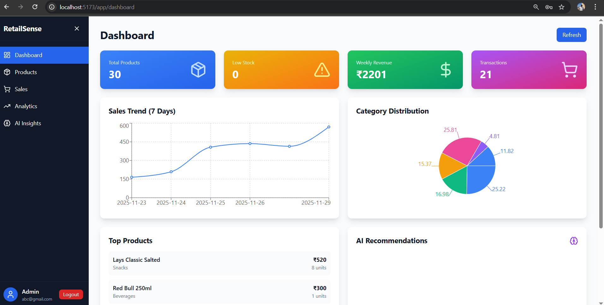
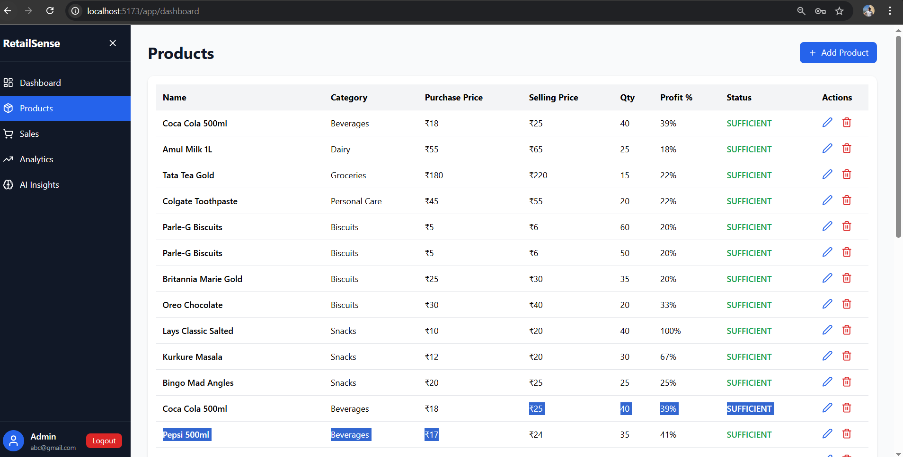
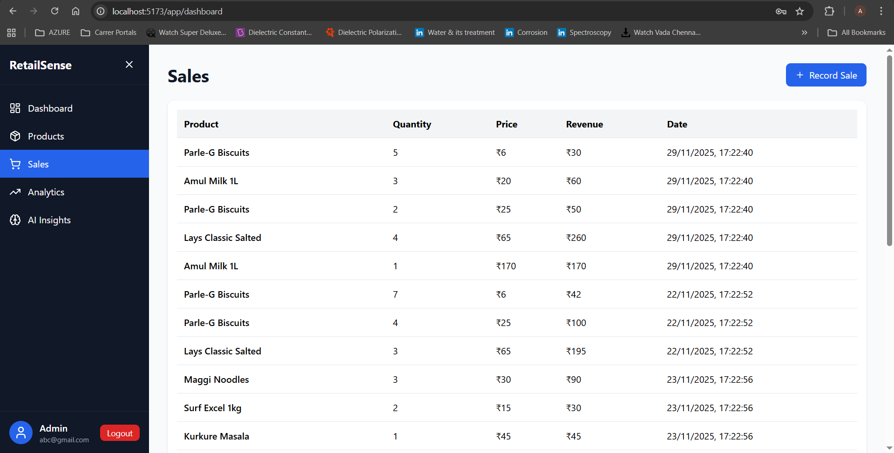

# 🛒 RetailSense - AI-Powered Inventory Management

[](https://spring.io/projects/spring-boot)
[](https://reactjs.org/)
[](LICENSE)

> A modern, full-stack inventory management system with AI-powered insights for small retail businesses.



---

## 📋 Table of Contents

- [Overview](#overview)
- [Problem Statement](#problem-statement)
- [Features](#features)
- [Tech Stack](#tech-stack)
- [Architecture](#architecture)
- [Getting Started](#getting-started)
- [API Documentation](#api-documentation)
- [Screenshots](#screenshots)
- [Roadmap](#roadmap)
- [Contributing](#contributing)
- [License](#license)

---

## 🎯 Overview

RetailSense is a comprehensive inventory management solution designed specifically for small to medium-sized retail shops (like Kirana stores in India). It combines real-time inventory tracking, sales analytics, and AI-powered predictions to help shop owners make data-driven decisions.

### Key Highlights

- 📊 **Real-time Analytics** - Track sales trends with interactive charts
- 🤖 **AI Predictions** - Get intelligent reorder recommendations
- 🔐 **Secure** - JWT-based authentication and authorization
- 📱 **Modern UI** - Beautiful, responsive interface built with React
- ⚡ **Fast** - Optimized backend with Spring Boot
- 🏗️ **Scalable** - Modular architecture ready for growth

---

## ❓ Problem Statement

Small retail businesses in India face significant challenges:

| Problem | Impact |
|---------|--------|
| Manual inventory tracking | Time-consuming, error-prone |
| No sales insights | Missed opportunities, poor decisions |
| Overstocking | Capital locked, wastage |
| Stockouts | Lost sales, customer dissatisfaction |
| No reorder planning | Reactive instead of proactive |

**RetailSense solves these problems** by providing an affordable, easy-to-use digital solution.

---

## ✨ Features

### v1.0 (Current Release)

#### 🔐 Authentication & Security
- User registration and login
- JWT token-based authentication
- Secure password hashing (BCrypt)
- Protected API endpoints

#### 📦 Product Management
- Add, edit, delete products
- Category management
- Stock tracking with real-time updates
- Low stock alerts
- Profit margin calculation
- Search and filter functionality

 #### 💰 Sales Tracking
- Record sales transactions
- Automatic stock reduction
- Sales history with filters
- Revenue calculations
- Transaction summaries (daily/weekly/monthly)

#### 📊 Analytics Dashboard
- Sales trend visualization (7/14/30 days)
- Top-selling products
- Category-wise revenue distribution
- Revenue and profit summaries
- Interactive charts with Recharts

### Future Release

#### 🤖 AI Insights
- Predictive stock-out analysis
- Intelligent reorder recommendations
- Priority-based alerts (HIGH/MEDIUM/LOW)
- Sales velocity calculations
- Automated daily insights generation

---

## 🛠️ Tech Stack

### Backend
- **Framework:** Spring Boot 3.2.0
- **Language:** Java 17
- **Database:** PostgreSQL
- **Security:** Spring Security + JWT
- **Build Tool:** Maven (Multi-module)
- **ORM:** Hibernate/JPA
- **Validation:** Hibernate Validator

### Frontend
- **Framework:** React 18
- **Styling:** Tailwind CSS
- **Charts:** Recharts
- **State:** Context API
- **HTTP Client:** Fetch API
- **Build Tool:** Vite

### DevOps & Deployment
- **Backend Hosting:** Railway / Render
- **Frontend Hosting:** Vercel
- **Database:** Railway PostgreSQL
- **Version Control:** Git & GitHub

---

## 🏗️ Architecture

RetailSense follows a **modular monolith architecture** with clear separation of concerns:
```markdown
retailsense/
├── retailsense-backend/
│   ├── retailsense-common       # Shared utilities, exceptions, security
│   ├── retailsense-auth         # Authentication & authorization
│   ├── retailsense-product      # Product management
│   ├── retailsense-sales        # Sales tracking
│   ├── retailsense-analytics    # Data analytics
│   ├── retailsense-ai           # AI predictions
│   └── retailsense-app          # Main application
│
└── retailsense-frontend/
├── src/
│   ├── components/          # React components
│   ├── context/             # Auth context
│   ├── pages/               # Page components
│   └── utils/               # Helper functions
└── public/
```

### Module Responsibilities

| Module | Responsibility |
|--------|---------------|
| **common** | Base entities, exceptions, security config, utilities |
| **auth** | User management, JWT generation, login/register |
| **product** | Product CRUD, stock management, categories |
| **sales** | Transaction recording, stock reduction, summaries |
| **analytics** | Sales trends, top products, revenue analysis |
| **ai** | Predictive analytics, reorder recommendations |
| **app** | Application entry point, configuration |

### Data Flow
```markdown
User Request → React UI → API Call (+ JWT Token)
↓
Spring Security Filter (Validate Token)
↓
Controller (HTTP Layer)
↓
Service (Business Logic)
↓
Repository (Database Access)
↓
PostgreSQL Database
```
---

## 🚀 Getting Started

### Prerequisites

- Java 17 or higher
- Maven 3.8+
- PostgreSQL 14+
- Node.js 18+ and npm
- Git

### Backend Setup

1. **Clone the repository**
```bash
git clone https://github.com/Akash-1208/retailsense.git
cd retailsense/retailsense-backend
```

2. **Configure database**
Create a PostgreSQL database:
```sql
CREATE DATABASE retailsense_db;
```

Update `retailsense-app/src/main/resources/application.properties`:
```properties
spring.datasource.url=jdbc:postgresql://localhost:5432/retailsense_db
spring.datasource.username=your_username
spring.datasource.password=your_password
jwt.secret=your-secret-key-min-256-bits
```

3. **Build and run**
```bash
# Build all modules
mvn clean install

# Run application
mvn spring-boot:run -pl retailsense-app
```

Backend will start on `http://localhost:8080`

### Frontend Setup

1. **Navigate to frontend**
```bash
cd ../retailsense-frontend
```

2. **Install dependencies**
```bash
npm install
```

3. **Configure API URL**
Create `.env` file:
VITE_API_BASE_URL=http://localhost:8080/api

4. **Run development server**
```bash
npm run dev
```

Frontend will start on `http://localhost:5173`

### Quick Test

1. Open browser to `http://localhost:5173`
2. Register a new account
3. Login with credentials
4. Start adding products!

---

## 📡 API Documentation

### Authentication Endpoints
```http
POST /api/auth/register
POST /api/auth/login
```

### Product Endpoints
```http
GET    /api/products
GET    /api/products/{id}
POST   /api/products
PUT    /api/products/{id}
DELETE /api/products/{id}
GET    /api/products/categories
GET    /api/products/stats
```

### Sales Endpoints
```http
POST /api/sales
GET  /api/sales
GET  /api/sales/summary?period=week
```

### Analytics Endpoints
```http
GET /api/analytics/sales-trend?days=7
GET /api/analytics/top-products?limit=5
GET /api/analytics/category-distribution
GET /api/analytics/revenue-summary
```

### AI Endpoints
```http
GET  /api/ai/insights
GET  /api/ai/insights?priority=HIGH
POST /api/ai/insights/generate
GET  /api/ai/insights/product/{id}
```

**📄 Full API documentation:** [Link to Postman/Swagger]

---

## 📸 Screenshots

### Dashboard

*Real-time analytics with sales trends and AI insights*

### Products Management

*Intuitive product management with search and filters*

### Sales Entry

*Quick sales recording with stock updates*

### Analytics

*Quick sales recording with stock updates*

### AI Insights

*Intelligent reorder recommendations with priority alerts*

---

## 🗺️ Roadmap

### v1.0 ✅ (Current)
- [x] Authentication system
- [x] Product management
- [x] Analytics dashboard

### v2.0 🚧 (In Progress)
- [ ] Sales tracking
- [ ] Basic AI insights
- [ ] Advanced AI with OpenAI integration
- [ ] Multi-user support with roles
- [ ] Supplier management
- [ ] Email/SMS notifications
- [ ] Export reports (CSV, PDF)
- [ ] Expiry date tracking
- [ ] Barcode scanning

### v3.0 🔮 (Future)
- [ ] Mobile app (React Native)
- [ ] WhatsApp bot integration
- [ ] Multi-store support
- [ ] Accounting integration
- [ ] Point of Sale (POS) mode

---

## 🤝 Contributing

Contributions are welcome! Please feel free to submit a Pull Request.

1. Fork the repository
2. Create your feature branch (`git checkout -b feature/AmazingFeature`)
3. Commit your changes (`git commit -m 'Add some AmazingFeature'`)
4. Push to the branch (`git push origin feature/AmazingFeature`)
5. Open a Pull Request

---

## 📝 License

This project is licensed under the MIT License - see the [LICENSE](LICENSE) file for details.

---

## 👨‍💻 Author

**Your Name**
- GitHub: [@Akash-1208](https://github.com/Akash-1208)
- LinkedIn: [Akash LinkedIn](https://www.linkedin.com/in/kanakari-akash)
- Email: kanakariakash1208@gmail.com

---

## 🙏 Acknowledgments

- Inspired by the needs of small retailers in India
- Built with modern technologies and best practices
- Thanks to the open-source community

---

## 📊 Project Stats


---

**⭐ If you find this project useful, please consider giving it a star!**

---

*Built with ❤️ for small businesses in India*
